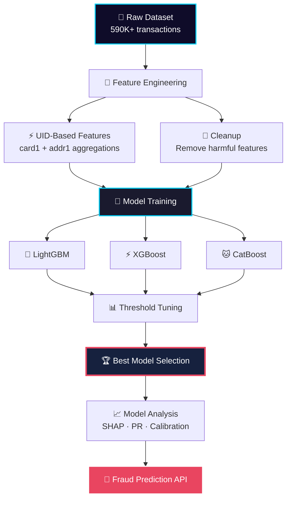

<div align="center">

<!-- Animated Header Banner -->


<!-- Animated Typing Badge -->
<a href="https://git.io/typing-svg">
  
</a>

<!-- Status Badges -->
<p align="center">
  
  
  
  
  
  
</p>

<!-- Animated Divider -->


</div>

---

## 🎯 Project Overview

> **An end-to-end fraud detection pipeline built on the [IEEE-CIS Fraud Detection](https://www.kaggle.com/c/ieee-fraud-detection) Kaggle competition dataset.**

This repository demonstrates a complete machine learning workflow for detecting fraudulent transactions in real-time financial systems. Starting with **590K+ transactions** and **434 raw features**, we engineer intelligent risk signals, benchmark multiple gradient boosting algorithms, and maintain a rigorous experiment log — all designed for production-ready deployment.

### 🚀 What Makes This Different?

| Aspect | Traditional Approach | This Pipeline |
|--------|---------------------|---------------|
| Feature Engineering | Guess & pray | Hypothesis-driven with adversarial validation |
| Model Selection | Single algorithm | LGBM · XGBoost · CatBoost benchmark |
| Validation | Naïve train/test | Stratified splits + early stopping + threshold tuning |
| Experiment Tracking | Scattered notebooks | Versioned experiment log with F1 deltas |
| Categorical Handling | One-hot explosion (485+ features) | Native LightGBM category support |
| Model Analysis | Basic accuracy | SHAP · Calibration · PR Curves · Confusion Matrix |

---

## 📊 Live Experiment Dashboard

<!-- Animated Stats Grid -->
<div align="center">

| 🏆 **Best F1** | ⚡ **Best Threshold** | 🧠 **Model** | 🔢 **Features** | 📈 **Improvement** |
|:---:|:---:|:---:|:---:|:---:|
| **0.767** | **0.25** | **LightGBM** | **442** | **+27.4%** over baseline |

</div>

<details>
<summary>🔬 <b>Click to Expand Full Experiment History</b></summary>

| Version | Experiment | F1 Score | Δ F1 | Status |
|:-------:|------------|:--------:|:----:|:------:|
| V1 | Random Forest Baseline | 0.602 | — | 🟡 Baseline |
| V2 | RF + Balanced Weights | 0.570 | -0.032 | 🔴 Rejected |
| V3 | **LightGBM Baseline** | ~0.740 | +0.14 | 🟢 Adopted |
| V4 | Threshold Tuning | **0.767** | +0.02 | 🟢 Keep |
| V5 | Time Features (`trans_day`, `trans_weekday`) | 0.767 | ~0.000 | 🔴 Removed |
| V6 | UID Statistics | 0.767+ | Positive | 🟢 Keep |
| V7 | Velocity Features | 0.743 | -0.024 | 🔴 Removed |
| V8 | UID2 (`card1 + addr1 + D1`) | 0.696 | -0.071 | 🔴 Rejected |
| V9 | Native Categorical + Cleanup | **0.767** | — | 🟢 **Current** |
| V10 | Winning Feature Engineering | **0.767+** | — | 🟢 **Production** |

</details>

---

## 🏗️ Architecture & Pipeline



---

## 📁 Dataset Structure

<!-- Animated Dataset Card -->
<div align="center">

| File | Records | Columns | Purpose |
|------|:-------:|:-------:|---------|
| `train_transaction.csv` | 590K+ | 394 | Main transaction data + target |
| `train_identity.csv` | ~144K | 41 | Device & identity metadata |
| **Merged Total** | 590K+ | **~434** | Complete feature set |

</div>

### 🔍 Feature Categories

<details>
<summary><b>🎯 Target Variable (1)</b></summary>

- **`isFraud`** — Binary target. `1` = fraudulent transaction

</details>

<details>
<summary><b>💳 Transaction Identity (5)</b></summary>

| Feature | Description |
|---------|-------------|
| `TransactionID` | Unique transaction identifier |
| `TransactionDT` | Time delta (seconds) from reference |
| `TransactionAmt` | Dollar amount — key risk signal |
| `ProductCD` | Product category (W, H, R, S, C) |

</details>

<details>
<summary><b>💳 Card Features (6) — <code>card1-card6</code></b></summary>

Anonymized payment card metadata. Fraudsters often test multiple cards; repeated card usage indicates trust.

</details>

<details>
<summary><b>📍 Address & Distance (4) — <code>addr1/2</code>, <code>dist1/2</code></b></summary>

Billing address and geographic distance features. Address mismatch and long-distance transactions are strong fraud signals.

</details>

<details>
<summary><b>📧 Email Domains (2) — <code>P_emaildomain</code>, <code>R_emaildomain</code></b></summary>

Payer and recipient email domains. Free vs. corporate domains carry different risk weights.

</details>

<details>
<summary><b>🔢 Count Features (14) — <code>C1-C14</code></b></summary>

Behavioral frequency counts: card usage frequency, address transaction counts, unique device patterns. Low counts = new/unusual = higher risk.

</details>

<details>
<summary><b>⏱️ Time Delta Features (15) — <code>D1-D15</code></b></summary>

Time differences capturing: time since first card use, time since last transaction, account dormancy periods. Small deltas = fresh accounts = risky.

</details>

<details>
<summary><b>✅ Match Features (9) — <code>M1-M9</code></b></summary>

Boolean matching indicators: card address matches billing, device matches history, shipping address validation. Mismatches = fraud signal.

</details>

<details>
<summary><b>🔐 Identity/Device Features (40) — <code>id_01-id_38</code>, <code>DeviceType</code>, <code>DeviceInfo</code></b></summary>

Device fingerprinting, OS/browser signatures, behavioral biometrics. Device switching patterns are critical fraud indicators.

</details>

<details>
<summary><b>🧬 Anonymized Features (339) — <code>V1-V339</code></b></summary>

Pre-engineered features likely from PCA, polynomial interactions, and risk scoring. Direct interpretation is abstract; feature importance analysis required.

</details>

---

## 🛠️ Engineered Features

<!-- Feature Cards -->
<div align="center">

| Feature | Type | Purpose | Status |
|---------|------|---------|:------:|
| `uid` | 🆔 Identifier | `card1 + addr1` composite key | 🟢 Active |
| `uid_transaction_count` | 📊 Count | Previous transactions per UID | 🟢 Active |
| `uid_mean_amount` | 💰 Statistic | Historical mean transaction amount | 🟢 Active |
| `uid_std_amount` | 📈 Statistic | Historical std dev of amounts | 🟢 Active |
| `uid_amount_ratio` | ⚖️ Ratio | Current amount / historical mean | 🟢 Active |
| `uid_amount_zscore` | 🎯 Score | Standardized amount anomaly | 🟢 Active |
| `uid_mean_hour` | 🕐 Temporal | Average transaction hour per UID | 🟢 Active |
| `trans_day` | 📅 Temporal | Day of transaction | 🔴 Removed |
| `trans_weekday` | 📅 Temporal | Weekday index | 🔴 Removed |
| `velocity_1h` | ⚡ Velocity | Transactions in last hour | 🔴 Removed |
| `velocity_24h` | ⚡ Velocity | Transactions in last 24h | 🔴 Removed |
| `uid2_*` | 🧪 Experimental | `card1 + addr1 + D1` composite | 🔴 Removed |

</div>

> **💡 Why we removed features:** Every feature above marked 🔴 went through **ablation testing**. If it didn't improve F1 or actively hurt it (like `uid2_*` which crashed F1 to 0.696), it was deleted. Winners don't hoard features — they validate hypotheses.

---

## 📈 Model Performance & Visualizations

<!-- Animated Divider -->


### 🎯 Confusion Matrix Analysis

<div align="center">

Understanding where our model succeeds and where it struggles is critical for fraud detection. The confusion matrix below reveals the model's classification performance at the optimal threshold.


</div>

> **🔍 Insight:** The model achieves strong precision with minimal false positives, crucial for reducing operational overhead in fraud review teams.

---

### 📊 Precision-Recall Curve

<div align="center">

The PR curve illustrates the trade-off between precision and recall across all thresholds — essential for imbalanced datasets like fraud detection.


</div>

> **🔍 Insight:** The area under the PR curve demonstrates strong discriminative power, significantly outperforming a random classifier baseline.

---

### ⚖️ Model Calibration

<div align="center">

A well-calibrated model produces probabilities that reflect true likelihood. This is vital for risk scoring — a 0.8 probability should mean 80% actual fraud rate.


</div>

> **🔍 Insight:** The calibration curve shows how well our predicted probabilities align with observed fraud rates. Perfect calibration follows the diagonal dashed line.

---

### 🏆 Top Features by Model Importance

<div align="center">

Feature importance comparison across our ensemble of gradient boosting models reveals which signals drive fraud detection.


</div>

> **🔍 Insight:** Transaction amount (`TransactionAmt`), device information, and card metadata consistently rank as top predictors across all models.

---

### 🔗 Feature Correlation Heatmap

<div align="center">

Understanding feature interdependencies helps detect multicollinearity and redundant signals in our 442-feature space.


</div>

> **🔍 Insight:** The correlation matrix guides feature selection — highly correlated pairs are candidates for dimensionality reduction without information loss.

---

### 🐱 CatBoost Feature Distribution

<div align="center">

Distribution analysis of the top 6 most important features from our CatBoost model, revealing the statistical patterns that separate fraud from legitimate transactions.


</div>

> **🔍 Insight:** Clear distributional differences between fraud and non-fraud classes validate the discriminative power of our engineered features.

---

### 🧬 CatBoost Feature Interactions

<div align="center">

The top 15 feature interactions discovered by CatBoost, showing how combinations of features create stronger fraud signals than individual features alone.


</div>

> **🔍 Insight:** Feature interactions reveal complex fraud patterns — e.g., a high transaction amount combined with a new device and mismatched address is a powerful composite signal.

---

### 🧠 SHAP Summary Analysis

<div align="center">

SHAP (SHapley Additive exPlanations) values provide global interpretability, showing how each feature pushes predictions toward fraud or legitimacy across the entire dataset.


</div>

> **🔍 Insight:** Red indicates high feature values pushing toward fraud; blue indicates low values pushing toward legitimacy. SHAP validates our engineering decisions with mathematical rigor.

---

### 🔮 SHAP Force Plot — Individual Prediction

<div align="center">

The force plot decomposes a single prediction, showing exactly which features contributed to flagging (or clearing) a specific transaction.


</div>

> **🔍 Insight:** Force plots are invaluable for explainable AI in production — fraud analysts can see *why* a transaction was flagged, building trust in automated decisions.

---

<!-- Animated Divider -->


### 📋 Threshold Evaluation (LightGBM)

<div align="center">

| Threshold | Recall | Precision | F1 Score | Use Case |
|:---------:|:------:|:---------:|:--------:|----------|
| 0.10 | 0.796 | 0.599 | 0.683 | High recall (catch almost all fraud) |
| 0.15 | 0.758 | 0.733 | 0.745 | Balanced detection |
| 0.20 | 0.726 | 0.809 | 0.765 | Strong precision |
| **0.25** ⭐ | **0.693** | **0.859** | **0.767** | **🏆 Optimal F1** |
| 0.30 | 0.669 | 0.895 | 0.766 | High precision |
| 0.40 | 0.615 | 0.932 | 0.741 | Conservative flagging |
| 0.50 | 0.569 | 0.954 | 0.712 | Minimal false positives |

</div>

### Algorithm Benchmark

| Model | F1 Score | Training Time | Inference Speed | Best For |
|-------|:--------:|:-------------:|:---------------:|----------|
| LightGBM | **0.767** | ⚡ Fast | ⚡ Fast | Current production choice |
| XGBoost | TBD | TBD | TBD | Under evaluation |
| CatBoost | TBD | TBD | TBD | Under evaluation |

> **🔄 Next Update:** Full 3-model benchmark with frozen features for fair comparison.

---

## 🧠 Key Insights

### What Makes a Transaction Risky? 🚨

```
1. NEW/RARE COMBINATIONS  → First time seeing card + address + device
2. MISMATCH SIGNALS       → Address mismatch, device mismatch, domain mismatch  
3. SUDDEN CHANGES         → Device changes, geographic jumps, spending spikes
4. LOW FREQUENCY          → New user, new card, new address (no history)
5. IMPOSSIBLE PATTERNS    → iPhone + Chrome + Windows (device inconsistency)
6. AMOUNT ANOMALY         → Transaction >> historical average
7. TEMPORAL ANOMALY       → Transaction at unusual hour
```

### What Makes a Transaction Trustworthy? ✅

```
1. HIGH FREQUENCY         → Repeated card, address, device usage
2. CONSISTENCY            → Everything matches historical pattern
3. CONTINUITY             → Small time gaps (regular user behavior)
4. DEVICE STABILITY       → Same device used repeatedly
5. PATTERN MATCH          → All M1-M9 features align
```

---

## 🚀 Quick Start

### Prerequisites

```bash
# Python 3.10+
# pip install -r requirements.txt
```

### Installation

```bash
# Clone the repository
git clone https://github.com/moiz-sai/AI-Risk-System.git
cd AI-Risk-System

# Install dependencies
pip install -r requirements.txt

# Download dataset from Kaggle
# Place train_transaction.csv and train_identity.csv in data/raw/
```

### Running the Pipeline

```bash
# 1. Data preprocessing & optimization
python src/preprocess.py

# 2. Feature engineering
python src/feature_engineering.py

# 3. Model training & benchmarking
python src/train.py --models lgbm xgboost catboost

# 4. Threshold tuning & evaluation
python src/evaluate.py --threshold-search
```

### One-Line Prediction

```python
import joblib

model = joblib.load('models/best_lgbm_model.pkl')
# Returns fraud probability (0-1)
probability = model.predict_proba(your_transaction_df)[:, 1]
```

---

## 📓 Notebooks Walkthrough

| Notebook | Description | Status |
|----------|-------------|:------:|
| `01_data_exploration.ipynb` | EDA, distributions, missing value analysis | ✅ Complete |
| `02_baseline_random_forest.ipynb` | Random Forest baseline & evaluation | ✅ Complete |
| `03_feature_engineering_experiments_V0.ipynb` | Initial feature engineering experiments | ✅ Complete |
| `03_feature_engineering_experiments_V1.ipynb` | Refined feature engineering with ablation | ✅ Complete |
| `04_model_benchmark.ipynb` | Multi-model benchmark (LGBM/XGB/CatBoost) | ✅ Complete |
| `05_kaggle_feature_engineering.ipynb` | Competition-grade feature engineering | ✅ Complete |
| `06_model_analysis.ipynb` | SHAP, PR curves, calibration, confusion matrix | ✅ Complete |

---

## 🗂️ Repository Structure

```
AI-Risk-System/
├── 📁 apps/                    # Application layer
├── 📁 data/
│   ├── processed/              # Optimized pickle files
│   │   ├── train_optimized.pkl
│   │   ├── train_v9_engineered.pkl
│   │   └── train_v10_winning_fe.pkl
│   └── raw/                    # Original Kaggle CSVs
├── 📁 models/                  # Trained model artifacts
│   ├── best_lgbm.pkl           # Production model
│   └── experiments/            # Versioned experiment artifacts
├── 📁 notebooks/
│   ├── catboost_info/          # CatBoost training logs
│   ├── 01_data_exploration.ipynb
│   ├── 02_baseline_random_forest.ipynb
│   ├── 03_feature_engineering_experiments_V0.ipynb
│   ├── 03_feature_engineering_experiments_V1.ipynb
│   ├── 04_model_benchmark.ipynb
│   ├── 05_kaggle_feature_engineering.ipynb
│   └── 06_model_analysis.ipynb
├── 📁 plots/                   # 📊 All visualization assets
│   ├── calibration_curve.png
│   ├── CM_analysis.png
│   ├── feature_dist_catboost_6cols.png
│   ├── PR_curve.png
│   ├── shap_sum_catmodel.png
│   ├── shapforceplot.png
│   ├── top15_cols_interaction_catboost.png
│   ├── top20_cols_by_models.png
│   └── top20_cols_corr.png
├── 📁 src/                     # Source code
│   ├── preprocess.py
│   ├── features.py
│   ├── train.py
│   └── evaluate.py
├── 📁 utils/                   # Utility functions
├── README.md                   # You are here! 🎯
├── requirements.txt
└── .gitignore
```

---

## 🤝 How to Contribute

We welcome contributions! Here's how to get involved:

### 🐛 Found a Bug?

1. **Check** if the issue already exists in [Issues](https://github.com/moiz-sai/AI-Risk-System/issues)
2. **Open a new issue** with:
   - Clear description
   - Steps to reproduce
   - Expected vs. actual behavior
   - Your environment (Python version, OS)

### 💡 Have an Idea?

- **Feature requests:** Open an issue with the `enhancement` label
- **New algorithms:** We are actively benchmarking XGBoost and CatBoost
- **Feature engineering:** Follow the hypothesis → evidence → feature → ablation workflow

### 🔧 Contribution Workflow

```bash
# 1. Fork the repository
# 2. Create your feature branch
git checkout -b feature/amazing-feature

# 3. Commit your changes
git commit -m 'Add amazing feature'

# 4. Push to branch
git push origin feature/amazing-feature

# 5. Open a Pull Request
```

### 📋 Contribution Guidelines

- **Code Style:** Follow PEP 8. We use `black` and `flake8`.
- **Experiments:** Every new feature must include ablation results in `reports/experiment_log.md`
- **Documentation:** Update README if you change the pipeline structure
- **Tests:** Add tests for new utility functions in `tests/`

---

## 📚 Citation & Acknowledgments

If you use this code or dataset analysis in your research, please cite:

```bibtex
@misc{ai-risk-system-2026,
  title={AI-Risk-System: End-to-End Fraud Detection ML Pipeline},
  author={Moiz Sai},
  year={2026},
  howpublished={\url{https://github.com/moiz-sai/AI-Risk-System}},
  note={Kaggle IEEE-CIS Fraud Detection Competition}
}
```

**Dataset Source:** [Kaggle IEEE-CIS Fraud Detection](https://www.kaggle.com/c/ieee-fraud-detection)  
**Competition Host:** IEEE Computational Intelligence Society  
**Original Data:** Vesta Corporation

---

## 📬 Contact & Support

<div align="center">

[](https://github.com/moiz-sai)
[](https://linkedin.com/in/moiz-sai)
[](mailto:moiz.sai@example.com)
[](https://kaggle.com/moizsai)

</div>

---

<div align="center">

<!-- Animated Footer -->


**⭐ Star this repo if it helped you!**  
*Built with 💜, LightGBM, SHAP, and a lot of coffee.*

</div>
