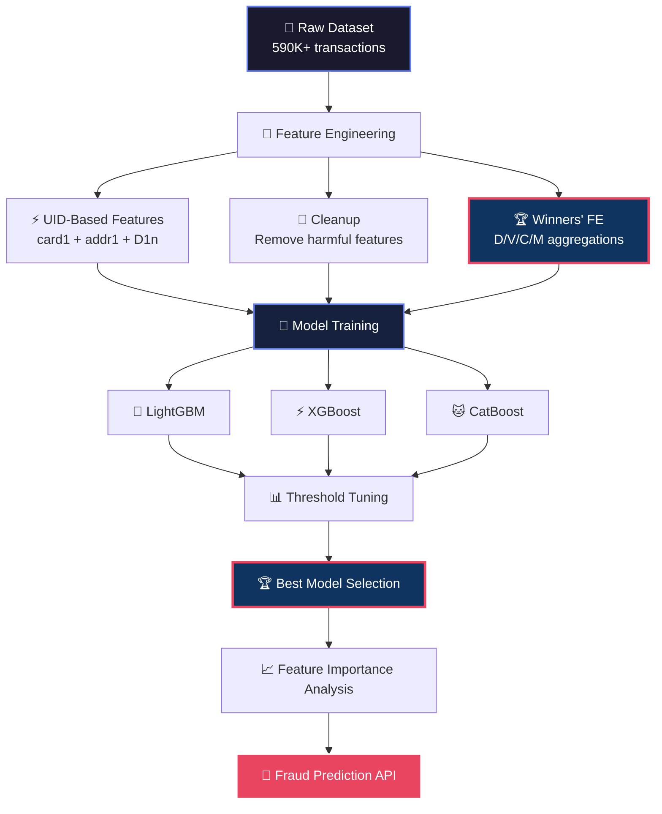

<div align="center">

<!-- Animated Header Banner -->


<!-- Animated Typing Badge -->
<a href="https://git.io/typing-svg">
  
</a>

<!-- Status Badges -->
<p align="center">
  
  
  
  
  
  
</p>

<!-- Animated Divider -->


</div>

---

## 🎯 Project Overview

> **An end-to-end fraud detection pipeline built on the [IEEE-CIS Fraud Detection](https://www.kaggle.com/c/ieee-fraud-detection) Kaggle competition dataset.**

This repository demonstrates a complete machine learning workflow for detecting fraudulent transactions in real-time financial systems. Starting with **590K+ transactions** and **434 raw features**, we engineer intelligent risk signals, benchmark multiple gradient boosting algorithms, and maintain a rigorous experiment log — all designed for production-ready deployment.

### 🚀 What Makes This Different?

| Aspect | Traditional Approach | This Pipeline |
|--------|---------------------|---------------|
| Feature Engineering | Guess & pray | Hypothesis-driven with ablation testing |
| Model Selection | Single algorithm | **LGBM · XGBoost · CatBoost** benchmarked head-to-head |
| Validation | Naïve train/test | Stratified splits + early stopping + threshold tuning |
| Experiment Tracking | Scattered notebooks | Versioned experiment log with F1 deltas |
| Categorical Handling | One-hot explosion (485+ features) | Native LightGBM / CatBoost category support |
| Winning Insights | Ignored | **Kaggle 1st-place FE (FraudSquad) implemented** |

---

## 📊 Live Experiment Dashboard

<!-- Animated Stats Grid -->
<div align="center">

| 🏆 **Best F1** | ⚡ **Best Threshold** | 🧠 **Model** | 🔢 **Features** | 📈 **Improvement** |
|:---:|:---:|:---:|:---:|:---:|
| **0.7881** | **0.25** | **CatBoost** | **470+** | **+30.9%** over baseline |

</div>

<details>
<summary>🔬 <b>Click to Expand Full Experiment History</b></summary>

| Version | Experiment | F1 Score | Δ F1 | Status |
|:-------:|------------|:--------:|:----:|:------:|
| V1 | Random Forest Baseline | 0.602 | — | 🟡 Baseline |
| V2 | RF + Balanced Weights | 0.570 | -0.032 | 🔴 Rejected |
| V3 | **LightGBM Baseline** | ~0.740 | +0.14 | 🟢 Adopted |
| V4 | Threshold Tuning | **0.748** | +0.02 | 🟢 Keep |
| V5 | Time Features (`trans_day`, `trans_weekday`) | 0.767 | ~0.000 | 🔴 Removed |
| V6 | UID Statistics (`uid_*` amount/hour/count) | 0.767+ | Positive | 🟢 Keep |
| V7 | Velocity Features (`velocity_1h`, `velocity_24h`) | 0.743 | -0.024 | 🔴 Removed |
| V8 | UID2 (`card1 + addr1 + D1`) | 0.696 | -0.071 | 🔴 Rejected |
| V9 | Native Categorical + Cleanup | **0.767** | ~+0.019 | 🟢 Clean Baseline |
| **V10** | **Kaggle Winners' FE + 3-Model Benchmark** | **0.7881** | **+0.021** | 🟢 **Current Best** |

</details>

---

## 🏗️ Architecture & Pipeline



---

## 📁 Dataset Structure

<!-- Animated Dataset Card -->
<div align="center">

| File | Records | Columns | Purpose |
|------|:-------:|:-------:|---------|
| `train_transaction.csv` | 590K+ | 394 | Main transaction data + target |
| `train_identity.csv` | ~144K | 41 | Device & identity metadata |
| **Merged Total** | 590K+ | **~434** | Complete feature set |

</div>

### 🔍 Feature Categories

<details>
<summary><b>🎯 Target Variable (1)</b></summary>

- **`isFraud`** — Binary target. `1` = fraudulent transaction

</details>

<details>
<summary><b>💳 Transaction Identity (5)</b></summary>

| Feature | Description |
|---------|-------------|
| `TransactionID` | Unique transaction identifier |
| `TransactionDT` | Time delta (seconds) from reference |
| `TransactionAmt` | Dollar amount — key risk signal |
| `ProductCD` | Product category (W, H, R, S, C) |

</details>

<details>
<summary><b>💳 Card Features (6) — <code>card1-card6</code></b></summary>

Anonymized payment card metadata. Fraudsters often test multiple cards; repeated card usage indicates trust.

</details>

<details>
<summary><b>📍 Address & Distance (4) — <code>addr1/2</code>, <code>dist1/2</code></b></summary>

Billing address and geographic distance features. Address mismatch and long-distance transactions are strong fraud signals.

</details>

<details>
<summary><b>📧 Email Domains (2) — <code>P_emaildomain</code>, <code>R_emaildomain</code></b></summary>

Payer and recipient email domains. Free vs. corporate domains carry different risk weights.

</details>

<details>
<summary><b>🔢 Count Features (14) — <code>C1-C14</code></b></summary>

Behavioral frequency counts: card usage frequency, address transaction counts, unique device patterns. Low counts = new/unusual = higher risk.

</details>

<details>
<summary><b>⏱️ Time Delta Features (15) — <code>D1-D15</code></b></summary>

Time differences capturing: time since first card use, time since last transaction, account dormancy periods. Small deltas = fresh accounts = risky.

</details>

<details>
<summary><b>✅ Match Features (9) — <code>M1-M9</code></b></summary>

Boolean matching indicators: card address matches billing, device matches history, shipping address validation. Mismatches = fraud signal.

</details>

<details>
<summary><b>🔐 Identity/Device Features (40) — <code>id_01-id_38</code>, <code>DeviceType</code>, <code>DeviceInfo</code></b></summary>

Device fingerprinting, OS/browser signatures, behavioral biometrics. Device switching patterns are critical fraud indicators.

</details>

<details>
<summary><b>🧬 Anonymized Features (339) — <code>V1-V339</code></b></summary>

Pre-engineered features likely from PCA, polynomial interactions, and risk scoring. Direct interpretation is abstract; feature importance analysis required.

</details>

---

## 🛠️ Engineered Features

### V9 Features (Baseline)

<div align="center">

| Feature | Type | Purpose | Status |
|---------|------|---------|:------:|
| `uid` | 🆔 Identifier | `card1 + addr1` composite key | 🟢 Active |
| `uid_transaction_count` | 📊 Count | Previous transactions per UID | 🟢 Active |
| `uid_mean_amount` | 💰 Statistic | Historical mean transaction amount | 🟢 Active |
| `uid_std_amount` | 📈 Statistic | Historical std dev of amounts | 🟢 Active |
| `uid_amount_ratio` | ⚖️ Ratio | Current amount / historical mean | 🟢 Active |
| `uid_amount_zscore` | 🎯 Score | Standardized amount anomaly | 🟢 Active |
| `uid_mean_hour` | 🕐 Temporal | Average transaction hour per UID | 🟢 Active |
| `trans_day` | 📅 Temporal | Day of transaction | 🔴 Removed |
| `trans_weekday` | 📅 Temporal | Weekday index | 🔴 Removed |
| `velocity_1h` | ⚡ Velocity | Transactions in last hour | 🔴 Removed |
| `velocity_24h` | ⚡ Velocity | Transactions in last 24h | 🔴 Removed |
| `uid2_*` | 🧪 Experimental | `card1 + addr1 + D1` composite | 🔴 Removed |

</div>

### V10 Winning Features (Kaggle 1st Place — FraudSquad)

> **💡 Source:** Based on [FraudSquad's winning solution](https://www.kaggle.com/competitions/ieee-fraud-detection/writeups/fraudsquad-1st-place-solution-part-2) and [alijs' 9th place notes](https://www.kaggle.com/competitions/ieee-fraud-detection/writeups/alko-9th-place-solution-notes). The key insight: **we are predicting fraudulent clients (credit cards), not individual transactions.**

<div align="center">

| Feature | Type | Purpose | Source |
|---------|------|---------|--------|
| `D1n` | ⏱️ Normalized | `day - D1` = card issue date | FraudSquad |
| `uid_d1n` | 🆔 Identifier | `card1 + addr1 + D1n` — **winning UID** | FraudSquad |
| `uid_D4n_mean/std` | 📈 Aggregation | D-column consistency per UID | FraudSquad |
| `uid_D10n_mean/std` | 📈 Aggregation | D-column consistency per UID | FraudSquad |
| `uid_D15n_mean/std` | 📈 Aggregation | D-column consistency per UID | FraudSquad |
| `uid_C13_nunique` | 🔢 Nunique | If > 1, UID contains multiple cards | FraudSquad |
| `uid_V127_nunique` | 🔢 Nunique | V-column client identification | FraudSquad |
| `uid_V136_nunique` | 🔢 Nunique | V-column client identification | FraudSquad |
| `uid_V307_nunique` | 🔢 Nunique | V-column client identification | FraudSquad |
| `uid_V309_nunique` | 🔢 Nunique | V-column client identification | FraudSquad |
| `uid_V314_nunique` | 🔢 Nunique | V-column client identification | FraudSquad |
| `uid_V320_nunique` | 🔢 Nunique | V-column client identification | FraudSquad |
| `uid_M1-M9_mean` | 📊 Mean | Match feature consistency per UID | FraudSquad |
| `uid_C1-C14_mean` | 📊 Mean | Count feature consistency per UID | FraudSquad |
| `uid_D9_mean/std` | 📈 Aggregation | Time delta consistency | FraudSquad |
| `uid_P_emaildomain_nunique` | 🔢 Nunique | Email domain diversity per UID | FraudSquad |
| `uid_id_02_nunique` | 🔢 Nunique | Identity consistency per UID | FraudSquad |

</div>

> **🔒 Critical Rule:** Raw `uid` and `uid_d1n` are **dropped before training**. The model only sees aggregated features. (68% of test clients are unseen — direct UID usage causes overfitting.)

---

## 🚀 Quick Start

### Prerequisites

```bash
# Python 3.10+
# pip install -r requirements.txt
```

### Installation

```bash
# Clone the repository
git clone https://github.com/moiz-sai/AI-Risk-System.git
cd AI-Risk-System

# Install dependencies
pip install -r requirements.txt

# Download dataset from Kaggle
# Place train_transaction.csv and train_identity.csv in data/raw/
```

### Running the Pipeline

```bash
# 1. Data preprocessing & optimization
python src/preprocess.py

# 2. Feature engineering (V9 baseline)
python src/feature_engineering.py

# 3. Winning feature engineering (V10)
notebooks/04_winning_features.ipynb

# 4. Model training & 3-model benchmark
notebooks/05_benchmark_3models.ipynb

# 5. Threshold tuning & evaluation
python src/evaluate.py --threshold-search
```

### One-Line Prediction

```python
import joblib

model = joblib.load('models/best_catboost_model.pkl')
# Returns fraud probability (0-1)
probability = model.predict_proba(your_transaction_df)[:, 1]
```

---

## 📈 Model Performance

### 🏆 3-Model Benchmark (V10 Features)

<div align="center">

| Model | Best F1 | Threshold | AUC | Training Time | Status |
|-------|:-------:|:---------:|:---:|:-------------:|:------:|
| **CatBoost** 🥇 | **0.7881** | **0.25** | **0.9672** | ~2 min (GPU) | 🟢 **Production Choice** |
| LightGBM 🥈 | 0.7669 | 0.25 | 0.9611 | ~1 min | 🟢 Strong Alternative |
| XGBoost 🥉 | 0.7454 | 0.25 | 0.9578 | ~3 min | 🟡 Baseline |

</div>

**Key CatBoost hyperparameters that flipped the switch:**
- `grow_policy='Lossguide'` — asymmetric tree growth (LightGBM-style) instead of default symmetric trees
- `depth=8` — deeper trees for finer client segmentation
- `l2_leaf_reg=3` — leaf weight regularization to prevent overfitting
- `task_type='GPU'` — CUDA acceleration for 2000 iterations
- `early_stopping_rounds=100` — patience for convergence

### Threshold Evaluation (CatBoost — Best Model)

<div align="center">

| Threshold | Recall | Precision | F1 Score | Use Case |
|:---------:|:------:|:---------:|:--------:|----------|
| 0.10 | 0.814 | 0.634 | 0.713 | High recall (catch almost all fraud) |
| 0.15 | 0.774 | 0.754 | 0.764 | Balanced detection |
| 0.20 | 0.745 | 0.829 | 0.785 | Strong precision |
| **0.25** ⭐ | **0.717** | **0.874** | **0.788** | **🏆 Optimal F1** |
| 0.30 | 0.695 | 0.900 | 0.785 | High precision |
| 0.40 | 0.651 | 0.936 | 0.768 | Conservative flagging |
| 0.50 | 0.607 | 0.953 | 0.742 | Minimal false positives |

</div>

### Algorithm Benchmark — Full History

| Model | Config | F1 Score | AUC | Notes |
|-------|--------|:--------:|:---:|-------|
| Random Forest | Baseline | 0.602 | — | V1 — Initial baseline |
| Random Forest | `class_weight='balanced'` | 0.570 | — | V2 — Worse F1 |
| LightGBM | Baseline | ~0.740 | — | V3 — Huge jump from RF |
| LightGBM | + Threshold tuning | 0.748 | — | V4 — Found optimal threshold |
| LightGBM | + UID stats | 0.767 | 0.9611 | V9 — Current clean baseline |
| **CatBoost** | **`depth=8`, `Lossguide`, GPU** | **0.7881** | **0.9672** | **V10 — 🏆 New Best** |
| XGBoost | `hist`, `subsample=0.8` | 0.7454 | 0.9578 | V10 — Label-encoded categoricals |

---

## 🧠 Key Insights

### What Makes a Transaction Risky? 🚨

```
1. NEW/RARE COMBINATIONS  → First time seeing card + address + device
2. MISMATCH SIGNALS       → Address mismatch, device mismatch, domain mismatch  
3. SUDDEN CHANGES         → Device changes, geographic jumps, spending spikes
4. LOW FREQUENCY          → New user, new card, new address (no history)
5. IMPOSSIBLE PATTERNS    → iPhone + Chrome + Windows (device inconsistency)
6. AMOUNT ANOMALY         → Transaction >> historical average
7. TEMPORAL ANOMALY       → Transaction at unusual hour
8. MULTI-CARD UID         → Same card1+addr1+D1n but different C13/V values
```

### What Makes a Transaction Trustworthy? ✅

```
1. HIGH FREQUENCY         → Repeated card, address, device usage
2. CONSISTENCY            → Everything matches historical pattern
3. CONTINUITY             → Small time gaps (regular user behavior)
4. DEVICE STABILITY       → Same device used repeatedly
5. PATTERN MATCH          → All M1-M9 features align
6. UID PURITY             → All transactions in UID have same label
```

### 🏆 Winning Insight from Kaggle Champions

> **"We are not predicting fraudulent transactions. We are predicting fraudulent clients (credit cards)."** — Chris Deotte, FraudSquad (1st Place)

Once a credit card has fraud, **all** its transactions are labeled fraud. This means:
- Client identity (`card1 + addr1 + D1n`) is the strongest signal
- Aggregating features per UID lets the model classify *clients* without memorizing UIDs
- Post-processing by averaging predictions per UID gives a free +0.0016 boost

---

## 🗂️ Repository Structure

```
AI-Risk-System/
├── 📁 data/
│   ├── raw/                    # Original Kaggle CSVs
│   ├── processed/              # Optimized pickle files
│   │   ├── train_optimized.pkl
│   │   ├── train_v9_engineered.pkl
│   │   └── train_v10_winning_fe.pkl
│   └── external/               # Supplementary data
├── 📁 notebooks/
│   ├── 01_eda.ipynb            # Exploratory data analysis
│   ├── 02_baseline.ipynb       # Random Forest baseline (V1-V2)
│   ├── 03_feature_engineering.ipynb  # V3-V9 experiments
│   ├── 04_winning_features.ipynb     # V10 — Kaggle winners' FE
│   └── 05_benchmark_3models.ipynb      # LGBM · XGB · CatBoost benchmark
├── 📁 src/
│   ├── preprocess.py           # Data cleaning & optimization
│   ├── features.py             # Feature engineering pipeline
│   ├── train.py                # Model training & benchmarking
│   └── evaluate.py             # Threshold tuning & metrics
├── 📁 models/
│   ├── best_catboost.pkl       # Production model (V10)
│   ├── best_lgbm.pkl           # Backup model
│   └── experiments/            # Versioned experiment artifacts
├── 📁 reports/
│   ├── figures/                # EDA plots & feature importance
│   └── experiment_log.md       # Detailed experiment history
├── README.md                   # You are here! 🎯
└── requirements.txt            # Python dependencies
```

---

## 🤝 How to Contribute

We welcome contributions! Here's how to get involved:

### 🐛 Found a Bug?

1. **Check** if the issue already exists in [Issues](https://github.com/moiz-sai/AI-Risk-System/issues)
2. **Open a new issue** with:
   - Clear description
   - Steps to reproduce
   - Expected vs. actual behavior
   - Your environment (Python version, OS, GPU/CPU)

### 💡 Have an Idea?

- **Feature requests:** Open an issue with the `enhancement` label
- **New algorithms:** We are exploring stacking/ensembling next
- **Feature engineering:** Follow the hypothesis → evidence → feature → ablation workflow

### 🔧 Contribution Workflow

```bash
# 1. Fork the repository
# 2. Create your feature branch
git checkout -b feature/amazing-feature

# 3. Commit your changes
git commit -m 'Add amazing feature'

# 4. Push to branch
git push origin feature/amazing-feature

# 5. Open a Pull Request
```

### 📋 Contribution Guidelines

- **Code Style:** Follow PEP 8. We use `black` and `flake8`.
- **Experiments:** Every new feature must include ablation results in `reports/experiment_log.md`
- **Documentation:** Update README if you change the pipeline structure
- **Tests:** Add tests for new utility functions in `tests/`

---

## 📚 Citation & Acknowledgments

If you use this code or dataset analysis in your research, please cite:

```bibtex
@misc{ieee-fraud-detection-2026,
  title={IEEE-CIS Fraud Detection: End-to-End ML Pipeline},
  author={Moiz Sai},
  year={2026},
  howpublished={\url{https://github.com/moiz-sai/AI-Risk-System}},
  note={Kaggle IEEE-CIS Fraud Detection Competition}
}
```

**Dataset Source:** [Kaggle IEEE-CIS Fraud Detection](https://www.kaggle.com/c/ieee-fraud-detection)  
**Competition Host:** IEEE Computational Intelligence Society  
**Original Data:** Vesta Corporation

### 🏆 Winning Solutions Referenced

- **1st Place — FraudSquad:** Chris Deotte & Konstantin Yakovlev ([Writeup](https://www.kaggle.com/competitions/ieee-fraud-detection/writeups/fraudsquad-1st-place-solution-part-2))
- **9th Place — alijs:** Alijs & Konstantin Nikolaev ([Writeup](https://www.kaggle.com/competitions/ieee-fraud-detection/writeups/alko-9th-place-solution-notes))

---

## 📬 Contact & Support

<div align="center">

[](https://linkedin.com/in/moizsai)
[](mailto:moizsai@example.com)
[](https://kaggle.com/moizsai)

</div>

---

<div align="center">

<!-- Animated Footer -->


**⭐ Star this repo if it helped you!**  
*Built with 💜, CatBoost, and a lot of coffee.*

</div>
